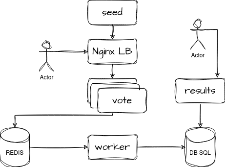

# Docker project

The goal of the project is to deploy the following application by using Docker and Docker compose. You will give us a GitHub or Gitlab link for your project.



## Mandatory version
- one Dockerfile per service that exposes the internal port of the container
- one docker-compose.yml file to deploy the stack
- adequate `depends_on`
- two networks will be defined: `front-net` and `back-net`
- a README file explaining how to configure and deploy the stack

## Optional extended version
- healthchecks on vote, redis and db services (some scripts are given in `healthcheck` directory)
- reducing the size of images
- multistage build on the worker service (.NET)


## Some elements

The base image will contain the basic commands for the language the application is written in.
You should use a tag to specify which version of the image you want to pull.
For building purposes, it is good practice to use a tag containing the version together with the language and `slim`.
e.g. for Python `python:3.13-rc-slim`, for Node.js `node:18-slim`


### Vote service

This is a Python service. Before starting `app.py`:
- requirements have to be copied and installed in the container
- all necessary files and directories have to be copied in the container

Port mapping:
`5000` is used inside the container (see Python code). Each instance of vote will use the external port `500x` where `x` is the instance number

### Result service

This is a Node.js JavaScript service. Before running the code:
- copy package files into the container,
- install `nodemon` with `npm install -g nodemon`
- install more requirements:
```
npm ci
npm cache clean --force
mv /usr/local/app/node_modules /node_modules
```
- set the `PORT` environment variable

Finally, run the code with `node server.js`.


### Seed service

This is a Python and bash service. First the file `make-data.py` has to be executed in the container. Second, the file `generate-votes.sh` has to be executed when starting the container.

**TO COMPLETE for packages**

### Worker service

This is a C# service. It requires a little bit more work to compile and run:
- use this as a base image
```
mcr.microsoft.com/dotnet/sdk:7.0
```
  with the argument `--platform=${BUILDPLATFORM}`
- use `ARG` to define build arguments `TARGETPLATFORM`, `TARGETARCH` and `BUILDPLATFORM`. Print their values with `echo`.
- in the `source/` directory, copy all worker files form this repo and run
```
dotnet restore -a $TARGETARCH
dotnet publish -c release -o /app -a $TARGETARCH --self-contained false --no-restore
```
The application will be built inside the `/app` directory.

Now, we will use another base image to run the script: `mcr.microsoft.com/dotnet/runtime:7.0`.

In the `/app` directory of our new image:
- copy the content of `/app` from the build image
- launch with `dotnet Worker.dll`.


### Redis service

This is a simple redis service.

In order to perform healthchecks while Redis is running, there must be a volume attached to the container. You will need to mount local the repo directory `./healthchecks/` into the `/healthchecks/` directory of the container.

The check is done by executing the `redis.sh` script.


### Db service

This is a simple postgre service.

The same logic applies for healthchecks, mount a volume and use `postgres.sh` for checks.

Moreover, in order to persist the data that comes from the votes, you need to create a Docker volume and attach it to the container.
The volume will be named `db-data` and attached to the `/var/lib/postgresql/data` directory inside the container.


# Kubernetes project
